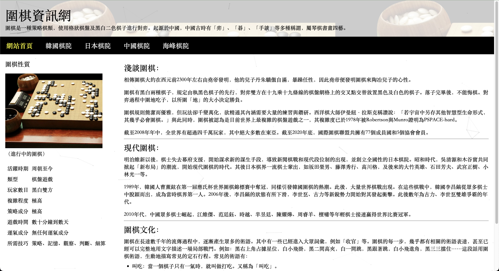
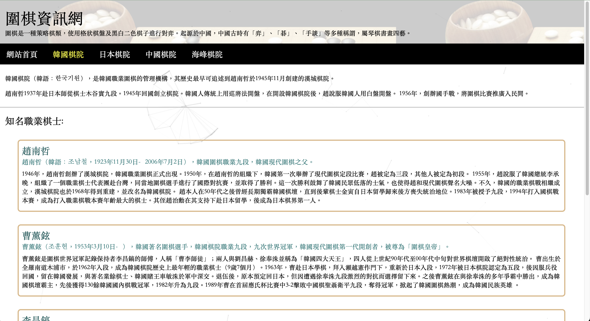
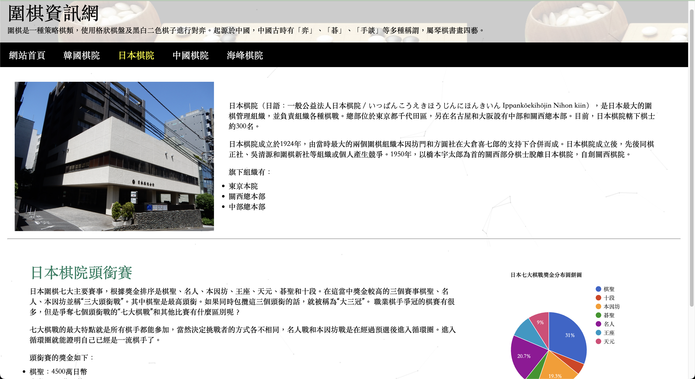
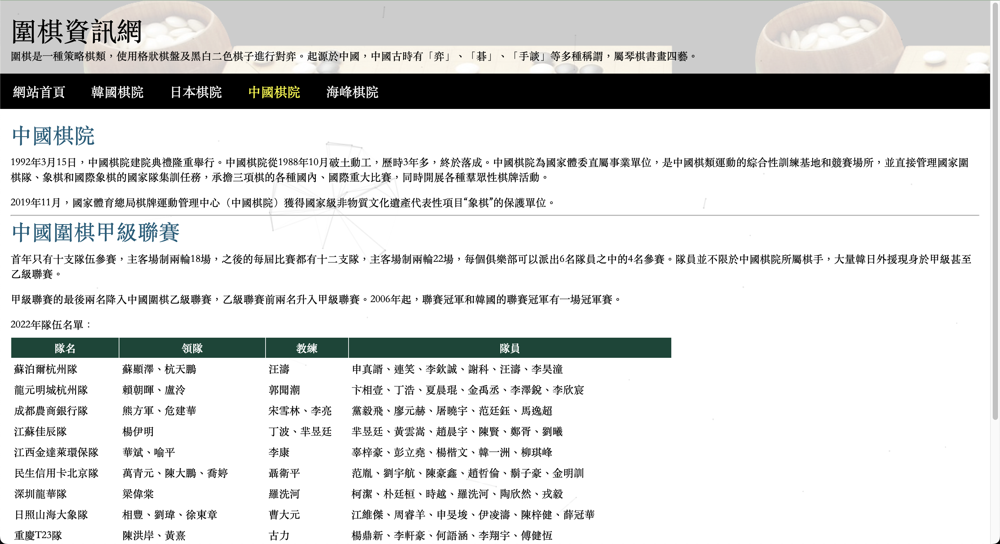
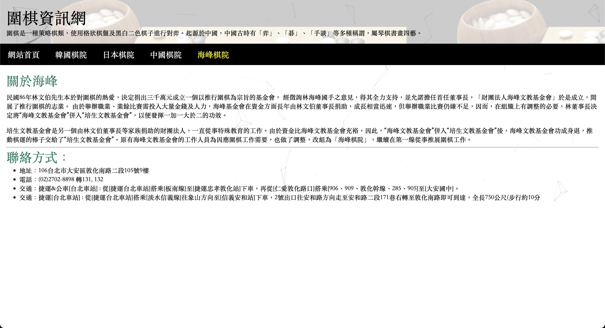

# 圍棋資訊網

這是一個介紹圍棋文化及各國棋院的靜態網站專案。
（這是個前端靜態網站，不需要伺服器即可運行）

## 功能特色

- 首頁介紹圍棋的歷史、性質和文化
- 分別介紹韓國、日本、中國和台灣(海峰)棋院
- 響應式設計，適應不同裝置螢幕
- 整合 Canvas-nest.js 實現動態背景效果

## 專案結構

```
project 1/
├── index.html      # 首頁
├── korea.html      # 韓國棋院頁面
├── japan.html      # 日本棋院頁面
├── china.html      # 中國棋院頁面
├── taiwan.html     # 海峰棋院頁面
├── style.css       # 樣式表
└── images/         # 圖片資源目錄
    ├── background.png
    ├── go-equipment.png
    └── ...
```

## 使用技術

- HTML5
- CSS3
- JavaScript
- Google Charts (用於日本棋院獎金分布圓餅圖)
- Canvas-nest.js (背景動態效果)

## 開發工具

- Visual Studio Code
- Live Server 擴充功能

## 截圖展示

首頁  

韓國棋院  

日本棋院  

中國棋院  

台灣海峰棋院  


## 作者

© 2025 Hensel Huang
Maintainer: Hensel Huang
